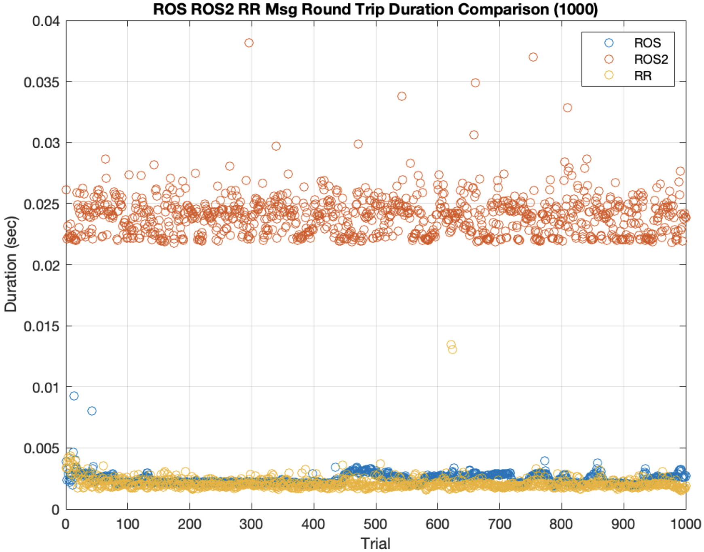
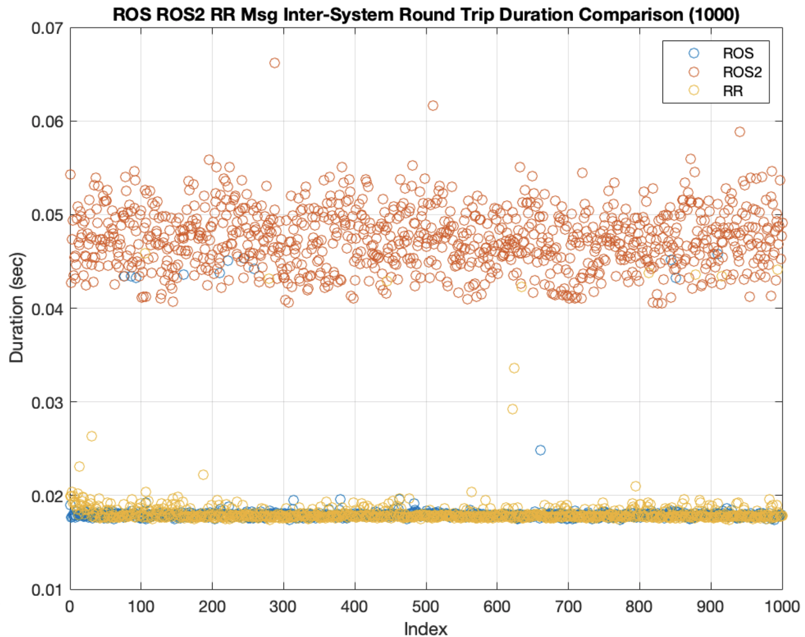
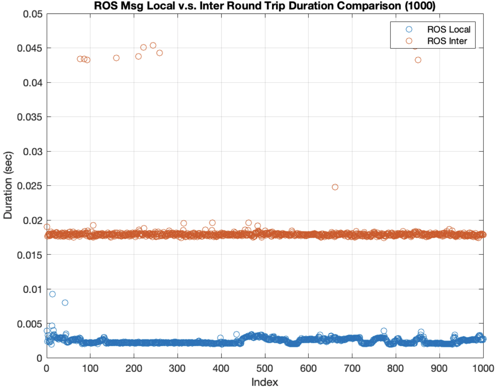
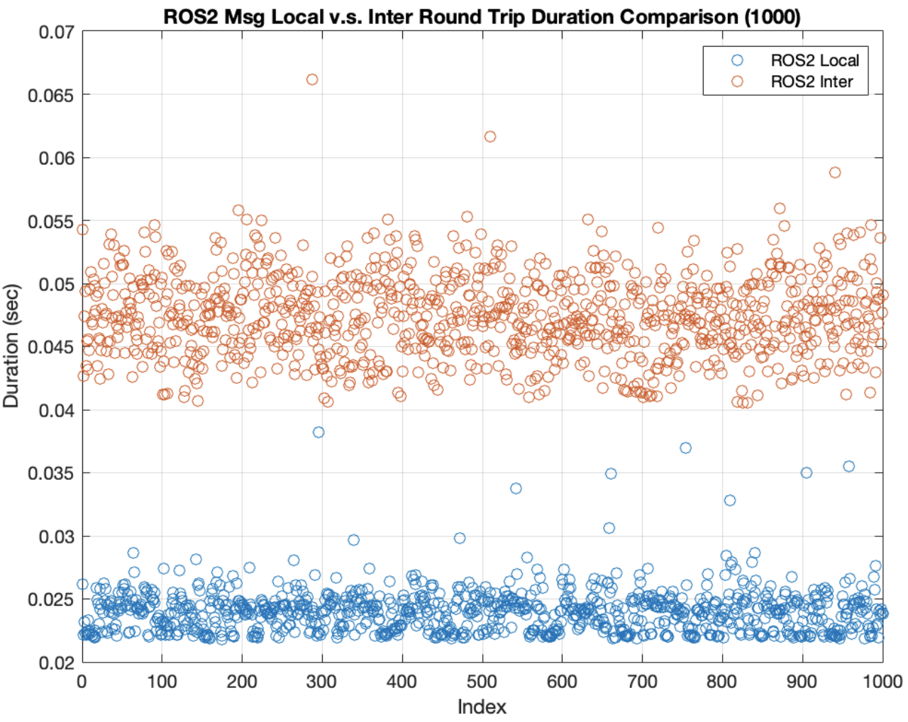
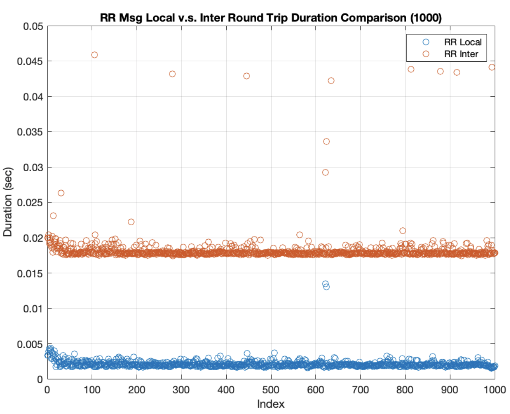

# ros_ros2_rr_duration_test
Duration of messages transmission test.

## Results

| S1 | S2            | OS            | Config            | Language | Msg Size (Bytes)          | Ave (s)          | Min (s)          | Max (s)          | Ave_Latency (us)        | Min_Latency (us)        | Max_Latency (us)        | Std                |
|----|---------------|---------------|-------------------|----------|---------------------------|------------------|------------------|------------------|-------------------------|-------------------------|-------------------------|---------------------|
| C4| | Ubuntu 20.04  | RR Core Default| Python            | 921,625 (640*480 RGB image)      | 2.0563938        | 2.019852         | 2.099185         | 1.0281969               | 0.7415                  | 7.122                   | 0.250355392681921   |
| C4| | Ubuntu 20.04  | ROS Noetic     | Python            | 921,617 (640*480 RGB image)      | 2.5086173578     | 2.382733101      | 2.65207148       | 1.2543086789            | 0.952244                | 4.621506                | 0.200596539695077   |
| C4| | Ubuntu 20.04  | ROS2 Foxy      | Python            | 921,625 (640*480 RGB image)      | 24.5155290126801 | 23.826461315155  | 27.019300699234  | 12.25776450634          | 10.8788013458252        | 271.725058555603        | 6.53866169363108    |
| C4 | C5            | Ubuntu 20.04  | RR Core Default    | Python   |                           | 18.1282026508    | 18.030632504     | 18.232302178     | 9.06410132540001        | 8.681218                | 23.3987745              | 1.09003955592152    |
| C4 | C5            | Ubuntu 20.04  | ROS Noetic         | Python   |                           | 18.5487089618    | 18.190631637     | 18.776019339     | 9.2743544809            | 8.707404                | 24.970889               | 2.03451682067943    |
| C4 | C5            | Ubuntu 20.04  | ROS2 Foxy          | Python   |                           | 47.5943154811859 | 47.4138152599335 | 47.7974545955658 | 23.797157740593         | 19.1072225570679        | 109.715819358826        | 2.10605051585674    |

<table>
  <tr>
    <td>
      
    </td>
    <td>
      
    </td>
  </tr>
</table>

<table>
  <tr>
    <td>
      
    </td>
    <td>
      
    </td>
    <td>
      
    </td>
  </tr>
</table>
